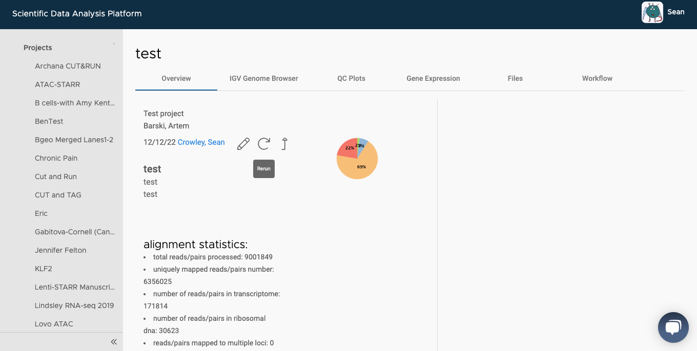
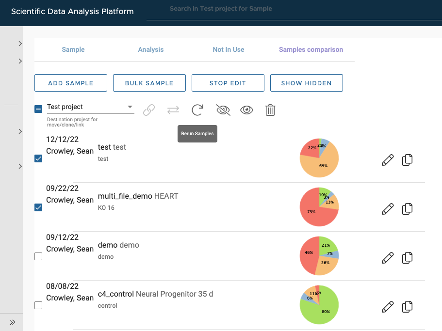

# Rerunning samples on SciDAP

You can rerun samples in two ways:

---

The first way is to view a single sample by clicking on it. Next to the "edit" (pencil) button is a rerun button. You'll be prompted to accept that you meant to rerun the sample.

---

The second way allows you to rerun multiple samples at once. 

After selecting a project from the side-nav, you can click the "edit samples" button (third from the left, next to "bulk sample").

From there, you can select multiple samples. After selecting, there are a number of actions you can take (listed directly under the main buttons). 

The circular icon is for rerunning selected samples. You can also hide/delete samples, or link them to other projects in your lab.

